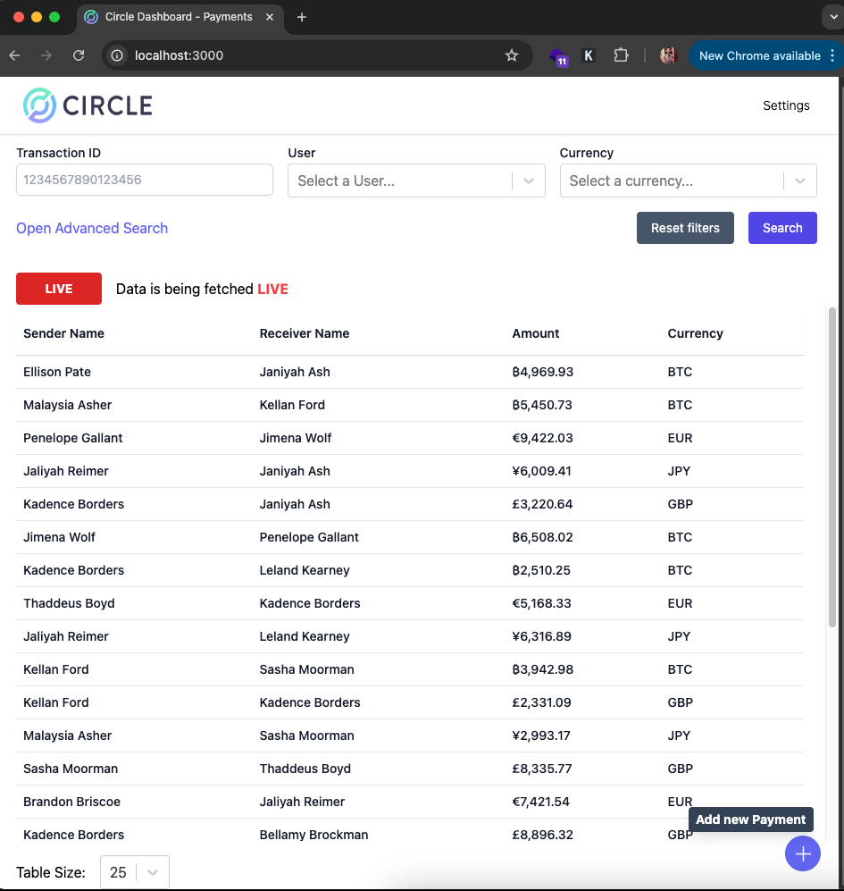
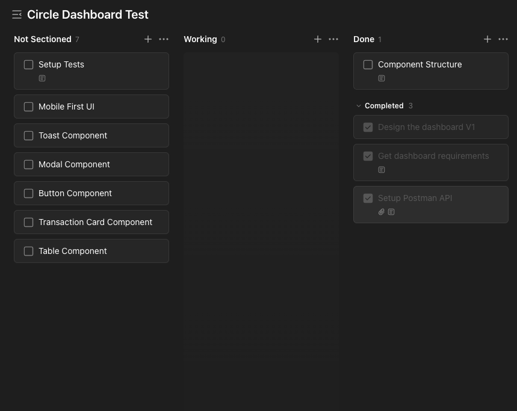
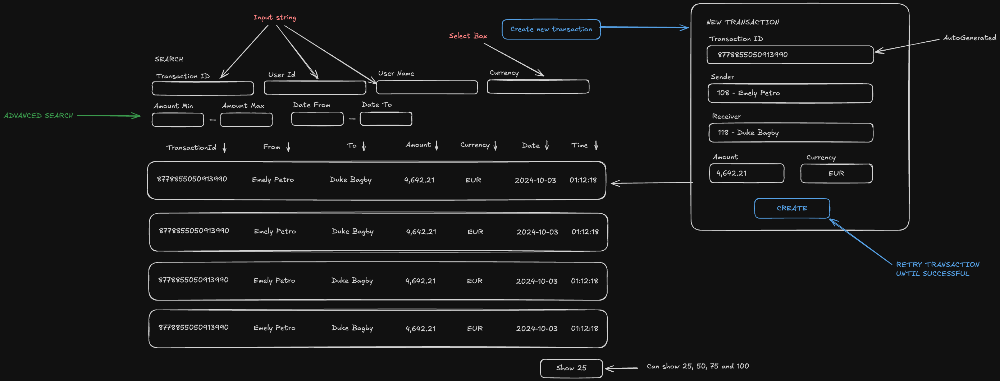

# Circle Frontend Takehome Test

This is the Circle Frontend Takehome test, created with [Next.js](https://nextjs.org)

## Getting Started

To run the project, run the following commands to run the development server:

```bash
yarn install
yarn dev
```

For running it in production, use the following commands:

```bash
yarn start
```

Open [http://localhost:3000](http://localhost:3000) with your browser to see the result.

### Environment

If you have the server running, please make sure it runs on the port 8080, if not, create a new `.env.local` following the `.env.example`
You don't really need to setup the environment variables if you have the following definitions:

- NEXT_PUBLIC_CIRCLE_API is `http://localhost:8080`. This is where you place the API URL to get the data from.
- NEXT_PUBLIC_MAX_PAYMENTS_COUNT is `1000`. This is the max amount of recent payments transactions to be stored.

### End Product



## Objectives

- Create a dashboard to see the latest 25 payments / transactions
- Be able to create a new transaction and see it on the table

## Project Management

You can lookup the project management of this takehome test [here](https://ticktick.com/pub/project/collaboration/invite/6e658317101f4a6ca15d7ccbad8516d6?u=da4ddf3abfb54c20898250d36ebdd00d)

It should look like this:
[](https://ticktick.com/pub/project/collaboration/invite/6e658317101f4a6ca15d7ccbad8516d6?u=da4ddf3abfb54c20898250d36ebdd00d)

## Design Phase

For the design, I choose a simple one page site where you are able to see and add new transactions into the dashboard.

Here's how I conceptualiced first:


The user in the dashboard should be able to:

- Filter by:
  - Transaction ID.
  - User Name or ID.
  - Currency.
  - Amount minimun and/or maximum.
  - Date From and/or Date to.

NOTE: Becase the date and time are so short/close together, I did not create a Date-from and/or Date-to filter.

When creating a new payment, the user should be able to:

- Select the user that will SEND the payment.
- Select the user that will RECEIVE the payment.
- Place an amount for the payment.
- Currency of the payment.

NOTE: The transaction ID will be automatically populated.
